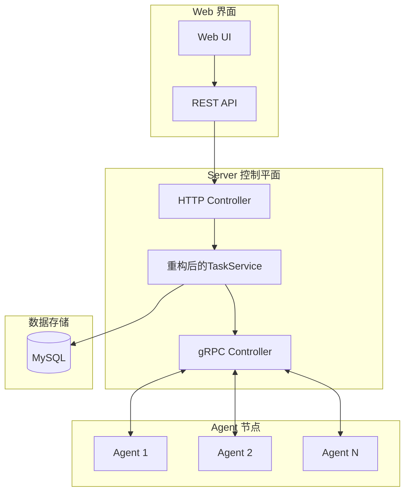
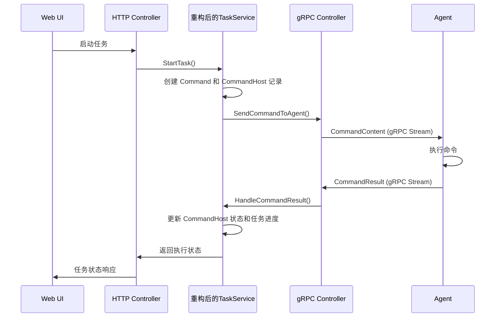
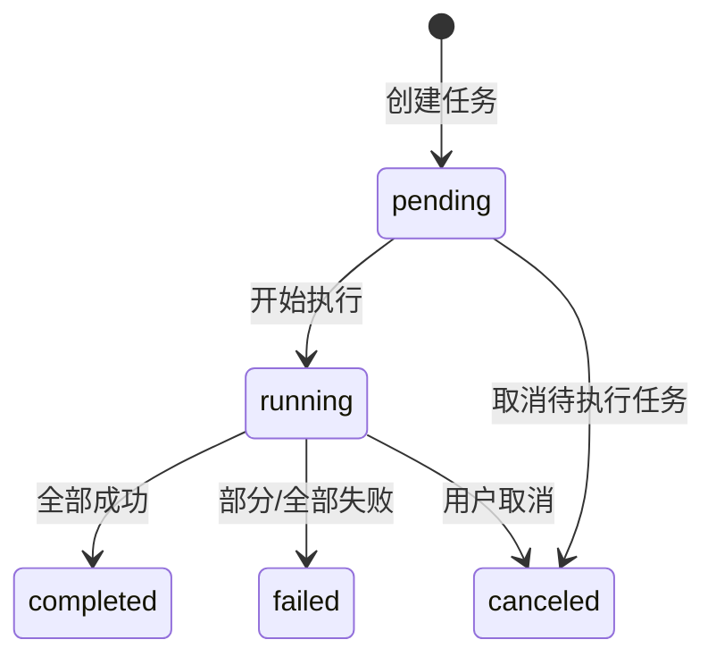
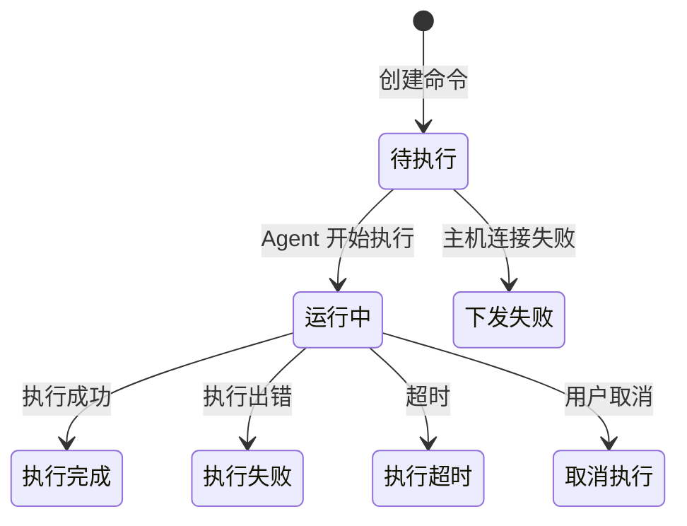

# 任务下发执行系统设计文档

## 概述

任务下发执行系统是 DevOps Manager 的核心功能模块，负责将用户创建的任务分发到目标主机并执行命令。系统采用分布式架构，通过 gRPC 双向流实现 Server 与 Agent 之间的实时通信，支持批量任务执行、实时状态监控、结果收集和错误处理。

### 设计目标

- **高可靠性**: 确保任务在大规模分布式环境中的可靠执行
- **实时监控**: 提供任务执行的实时状态跟踪和进度监控
- **错误处理**: 完善的超时、异常和错误处理机制
- **可扩展性**: 支持 10,000+ 客户端节点并发连接
- **审计追踪**: 完整的任务执行历史记录和日志收集

## 架构设计

### 系统架构图



### 核心组件

#### 1. TaskService (重构后的任务服务)
- **职责**: 任务管理、分发、状态管理、结果收集
- **位置**: `server/pkg/service/task_service.go` (重构现有文件)
- **功能**:
  - 将任务分解为具体的命令并下发到目标主机
  - 管理任务执行状态和进度
  - 处理超时和异常情况
  - 收集和汇总执行结果
  - 集成数据库操作替代内存存储

#### 2. gRPC 双向流通信
- **Server 端**: `server/pkg/controller/grpc_task_controller.go`
- **Agent 端**: `agent/pkg/controller/grpc_task_controller.go`
- **通信协议**: Protocol Buffers 定义在 `api/protobuf_base/command.proto`

#### 3. 数据模型层
- **Task**: 任务主体信息
- **Command**: 具体执行命令
- **CommandHost**: 命令与主机的关联关系
- **CommandResult**: 命令执行结果

## 组件和接口设计

### 1. TaskService 重构后接口设计

```go
type TaskService interface {
    // 现有方法保持不变
    CreateTask(name, description string, hostIDs []string, command string, timeout int, parameters string, createdBy string) (*models.Task, error)
    GetTask(taskID string) (*models.Task, error)
    GetTasks(page, size int, status, name string) ([]*models.Task, int, error)
    
    // 新增任务下发相关方法
    StartTask(taskID string) error
    CancelTask(taskID string) error
    GetTaskStatus(taskID string) (*TaskStatus, error)
    GetTaskProgress(taskID string) (*TaskProgress, error)
    HandleCommandResult(result *CommandResult) error
    HandleHostConnectionChange(hostID string, connected bool) error
}
```

### 2. gRPC 服务接口

基于现有的 `command.proto` 定义：

```protobuf
service CommandService {
    // Agent 连接到 Server 建立命令执行双向流
    rpc ConnectForCommands(stream CommandMessage) returns (stream CommandMessage);
}

message CommandMessage {
    oneof message {
        CommandContent command_content = 1;  // Server -> Agent: 命令内容
        CommandResult command_result = 2;    // Agent -> Server: 执行结果
    }
}
```

### 3. 数据流设计

#### 任务执行流程



## 数据模型设计

### 1. 核心数据模型

#### Task (任务)
```go
type Task struct {
    ID             uint           `json:"id" gorm:"primaryKey"`
    TaskID         string         `json:"task_id" gorm:"uniqueIndex"`
    Name           string         `json:"name"`
    Description    string         `json:"description"`
    Status         TaskStatus     `json:"status"`
    TotalHosts     int            `json:"total_hosts"`
    CompletedHosts int            `json:"completed_hosts"`
    FailedHosts    int            `json:"failed_hosts"`
    CreatedBy      string         `json:"created_by"`
    StartedAt      *time.Time     `json:"started_at"`
    FinishedAt     *time.Time     `json:"finished_at"`
    CreatedAt      time.Time      `json:"created_at"`
    UpdatedAt      time.Time      `json:"updated_at"`
    
    // 关联关系
    Commands []Command `json:"commands"`
}
```

#### Command (命令)
```go
type Command struct {
    ID         uint           `json:"id" gorm:"primaryKey"`
    CommandID  string         `json:"command_id" gorm:"uniqueIndex"`
    TaskID     *string        `json:"task_id"`
    HostID     string         `json:"host_id"`
    Command    string         `json:"command"`
    Parameters string         `json:"parameters"`
    Timeout    int64          `json:"timeout"`
    Status     CommandStatus  `json:"status"`
    // ... 其他字段
    
    // 关联关系
    CommandHosts []CommandHost `json:"command_hosts"`
}
```

#### CommandHost (命令主机关联)
```go
type CommandHost struct {
    ID            uint       `json:"id" gorm:"primaryKey"`
    CommandID     string     `json:"command_id"`
    HostID        string     `json:"host_id"`
    Status        string     `json:"status"`
    Stdout        string     `json:"stdout"`
    Stderr        string     `json:"stderr"`
    ExitCode      int        `json:"exit_code"`
    StartedAt     *time.Time `json:"started_at"`
    FinishedAt    *time.Time `json:"finished_at"`
    ErrorMessage  string     `json:"error_message"`
    ExecutionTime *int64     `json:"execution_time"`
    // ... 其他字段
}
```

### 2. 状态管理

#### 任务状态流转


#### 命令主机状态流转


## 错误处理设计

### 1. 超时处理机制

#### 命令级超时
- 每个命令可设置独立的超时时间
- Agent 端执行超时后自动终止进程
- Server 端超时后标记命令状态为"执行超时"

#### 任务级超时
- 任务整体超时控制
- 超时后取消所有未完成的命令

### 2. 连接异常处理

#### Agent 连接断开
- Server 端检测到连接断开后，标记相关命令为"下发失败"
- 实现连接重试机制
- 支持 Agent 重连后恢复任务执行

#### 网络分区处理
- 使用心跳机制检测网络状态
- 网络恢复后自动重新同步任务状态

### 3. 错误分类和处理策略

| 错误类型 | 处理策略 | 状态标记 |
|---------|---------|---------|
| 主机连接失败 | 标记为下发失败，不影响其他主机 | 下发失败 |
| 命令执行失败 | 记录错误信息，继续执行其他主机 | 执行失败 |
| 执行超时 | 终止执行，标记超时 | 执行超时 |
| Agent 异常断开 | 标记为执行失败，支持重连恢复 | 执行失败 |

## 测试策略

### 1. 单元测试
- **TaskDispatchService** 核心逻辑测试
- **gRPC Controller** 消息处理测试
- **数据模型** 状态转换测试
- **错误处理** 异常场景测试

### 2. 集成测试
- **Server-Agent 通信** 端到端测试
- **数据库操作** 事务一致性测试
- **并发执行** 多任务并发测试

### 3. 性能测试
- **大规模连接** 10,000+ Agent 连接测试
- **批量任务** 大批量命令执行测试
- **内存使用** 长时间运行内存泄漏测试

### 4. 故障测试
- **网络分区** 网络中断恢复测试
- **Agent 异常** Agent 崩溃重启测试
- **数据库故障** 数据库连接异常测试

## 性能优化设计

### 1. 连接管理优化
- **连接池**: 使用 gRPC 连接池管理 Agent 连接
- **心跳机制**: 定期心跳检测连接状态
- **连接复用**: 同一 Agent 的多个命令复用连接

### 2. 数据库优化
- **批量操作**: 批量更新 CommandHost 状态
- **索引优化**: 为查询频繁的字段添加索引
- **分页查询**: 大数据量查询使用分页
- **连接池**: 优化数据库连接池配置

### 3. 内存管理
- **任务清理**: 定期清理已完成的任务记录
- **查询优化**: 优化数据库查询减少内存使用
- **流式处理**: 大量数据使用流式处理避免内存溢出

### 4. 并发控制
- **任务队列**: 实现任务队列控制并发执行数量
- **限流机制**: 防止单个 Agent 过载
- **负载均衡**: 合理分配任务到不同 Agent

## 安全考虑

### 1. 命令安全
- **命令验证**: Agent 端验证命令安全性
- **权限控制**: 基于用户角色的命令执行权限
- **命令审计**: 记录所有执行的命令用于审计

### 2. 通信安全
- **TLS 加密**: gRPC 通信使用 TLS 加密
- **身份认证**: Agent 连接时进行身份验证
- **消息完整性**: 确保消息传输完整性

### 3. 数据安全
- **敏感信息**: 敏感参数加密存储
- **访问控制**: 数据库访问权限控制
- **日志脱敏**: 日志中敏感信息脱敏处理

## 监控和日志

### 1. 关键指标监控
- **任务执行成功率**: 监控任务整体成功率
- **命令执行时长**: 监控命令执行性能
- **Agent 连接状态**: 监控 Agent 连接健康度
- **系统资源使用**: 监控 CPU、内存、网络使用情况

### 2. 日志记录
- **任务生命周期**: 记录任务从创建到完成的全过程
- **命令执行详情**: 记录每个命令的执行详情
- **错误和异常**: 详细记录所有错误和异常信息
- **性能指标**: 记录关键性能指标用于分析

### 3. 告警机制
- **任务失败告警**: 任务失败率超过阈值时告警
- **Agent 离线告警**: 关键 Agent 离线时告警
- **系统异常告警**: 系统异常时及时告警

## 部署和运维

### 1. 部署架构
- **高可用部署**: Server 端支持多实例部署
- **负载均衡**: 使用负载均衡器分发请求
- **数据库集群**: MySQL 主从复制或集群部署

### 2. 配置管理
- **环境配置**: 支持不同环境的配置管理
- **动态配置**: 支持运行时配置更新
- **配置验证**: 配置文件格式和内容验证

### 3. 运维工具
- **健康检查**: 提供健康检查接口
- **指标导出**: 支持 Prometheus 指标导出
- **管理接口**: 提供运维管理接口

## 扩展性设计

### 1. 水平扩展
- **Server 集群**: 支持 Server 端水平扩展
- **数据分片**: 支持数据库分片扩展
- **缓存集群**: Redis 集群支持

### 2. 功能扩展
- **插件机制**: 支持自定义命令处理插件
- **协议扩展**: 支持多种通信协议
- **存储扩展**: 支持多种存储后端

### 3. 集成扩展
- **API 集成**: 提供完整的 REST API
- **消息队列**: 支持消息队列集成
- **第三方系统**: 支持与第三方系统集成