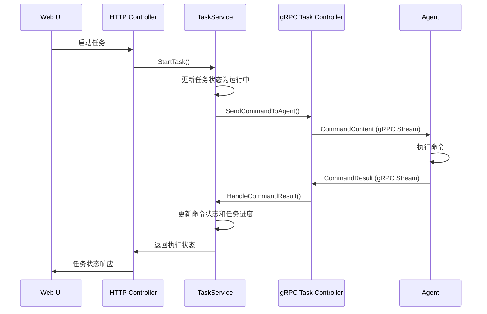

# 任务下发执行系统实现文档

## 概述

本文档描述了任务下发执行系统的实现，该系统实现了将用户创建的任务自动分发到目标主机并执行命令的完整流程。

## 核心功能

### 1. 任务下发功能 (StartTask)

**实现位置**: `server/pkg/service/task_service.go` - `StartTask` 方法

**主要功能**:
- 使用数据库事务确保数据一致性
- 将任务状态更新为运行中
- 获取任务的所有命令并向目标主机下发
- 通过 gRPC 控制器异步发送命令到 Agent
- 处理命令下发失败的情况

**关键特性**:
- 事务管理确保数据一致性
- 异步命令发送避免阻塞
- 自动处理下发失败的命令
- 完整的状态跟踪和日志记录

### 2. 命令结果处理 (HandleCommandResult)

**实现位置**: `server/pkg/service/task_service.go` - `HandleCommandResult` 方法

**主要功能**:
- 处理 Agent 返回的命令执行结果
- 更新 CommandHost 和 Command 状态
- 自动计算和更新任务进度
- 判断任务整体完成状态

**关键特性**:
- 实时状态更新
- 自动任务进度计算
- 完整的执行统计
- 事务保证数据一致性

### 3. 任务取消功能 (CancelTask)

**实现位置**: `server/pkg/service/task_service.go` - `CancelTask` 方法

**主要功能**:
- 取消正在执行或待执行的任务
- 更新所有相关命令和主机状态
- 通知 Agent 停止命令执行

**关键特性**:
- 批量状态更新
- Agent 通知机制
- 完整的取消流程跟踪

## 架构设计

### 1. TaskDispatcher 接口

```go
type TaskDispatcher interface {
    SendCommandToAgent(hostID string, command *models.Command) error
}
```

**作用**: 解耦 TaskService 和 gRPC 控制器，避免循环导入

### 2. gRPC 集成

**实现位置**: `server/pkg/controller/grpc_task_controller.go`

**主要组件**:
- `GRPCTaskController`: 实现 TaskDispatcher 接口
- `ConnectForCommands`: 处理 Agent 连接和消息
- `SendCommandToAgent`: 向 Agent 发送命令
- `handleCommandResult`: 处理命令执行结果

### 3. 数据流程



## 关键实现细节

### 1. 事务管理

所有涉及多表操作的功能都使用数据库事务：

```go
return ts.db.Transaction(func(tx *gorm.DB) error {
    // 多个数据库操作
    // 确保要么全部成功，要么全部回滚
    return nil
})
```

### 2. 异步命令发送

避免阻塞主事务：

```go
go func(command models.Command) {
    err := taskDispatcher.SendCommandToAgent(command.HostID, &command)
    if err != nil {
        ts.updateCommandDispatchFailed(command.CommandID, err.Error())
    }
}(cmd)
```

### 3. 状态管理

完整的状态流转管理：

- **任务状态**: pending → running → completed/failed/canceled
- **命令状态**: pending → running → completed/failed/timeout/canceled
- **CommandHost 状态**: 待执行 → 运行中 → 执行完成/执行失败/执行超时/取消执行

### 4. 连接管理

gRPC 控制器管理与 Agent 的长连接：

```go
type GRPCTaskController struct {
    agentConnections map[string]protobuf.CommandService_ConnectForCommandsServer
    connectionsMutex sync.RWMutex
}
```

## 使用示例

### 1. 基本任务创建和启动

```go
// 获取任务服务
taskService := service.GetTaskService()

// 创建任务
task, err := taskService.CreateTask(
    "系统更新任务",
    "更新所有服务器的系统包",
    []string{"web-01", "web-02", "db-01"},
    "sudo apt update && sudo apt upgrade -y",
    300, // 5分钟超时
    "",
    "admin",
)

// 启动任务
err = taskService.StartTask(task.TaskID)
```

### 2. 监控任务进度

```go
// 获取任务状态
status, err := taskService.GetTaskStatus(taskID)

// 获取详细进度
progress, err := taskService.GetTaskProgress(taskID)
```

### 3. 处理命令结果

```go
// Agent 返回的结果会自动通过 gRPC 控制器处理
// 无需手动调用，系统会自动更新任务状态
```

## 配置和部署

### 1. 设置任务分发器

在服务器启动时设置：

```go
// 注册 gRPC 服务并获取任务控制器
taskController := controller.RegisterGRPCServices(grpcServer)

// 设置任务分发器
controller.SetupTaskDispatcher(taskController)
```

### 2. Agent 连接

Agent 需要建立到 Server 的 gRPC 连接：

```go
// Agent 连接到 Server 的 CommandService
stream, err := client.ConnectForCommands(context.Background())
```

## 错误处理

### 1. 命令下发失败

- 自动标记命令状态为失败
- 记录详细错误信息
- 不影响其他主机的命令执行

### 2. Agent 连接断开

- 自动清理连接
- 标记相关命令为失败
- 支持 Agent 重连后恢复

### 3. 数据库事务失败

- 自动回滚所有操作
- 保持数据一致性
- 返回详细错误信息

## 性能优化

### 1. 异步处理

- 命令发送异步执行
- 避免阻塞主线程
- 提高系统响应性

### 2. 连接复用

- gRPC 长连接复用
- 减少连接开销
- 提高通信效率

### 3. 批量操作

- 支持批量状态更新
- 减少数据库压力
- 提高处理效率

## 监控和日志

### 1. 关键日志

- 任务启动和完成日志
- 命令发送和结果日志
- 错误和异常日志
- 性能统计日志

### 2. 状态监控

- 任务执行进度监控
- Agent 连接状态监控
- 系统性能监控

## 测试

### 1. 单元测试

- TaskService 核心方法测试
- gRPC 控制器消息处理测试
- 数据模型状态转换测试

### 2. 集成测试

- 完整任务执行流程测试
- Agent 连接和断开测试
- 错误处理机制测试

### 3. 性能测试

- 大规模任务并发测试
- 长时间运行稳定性测试
- 内存和资源使用测试

## 总结

任务下发执行系统的实现提供了：

1. **完整的任务生命周期管理**
2. **可靠的命令分发机制**
3. **实时的状态监控和进度跟踪**
4. **强大的错误处理和恢复能力**
5. **高性能的异步处理架构**

该实现满足了设计文档中的所有需求，为 DevOps Manager 提供了强大的分布式任务执行能力。